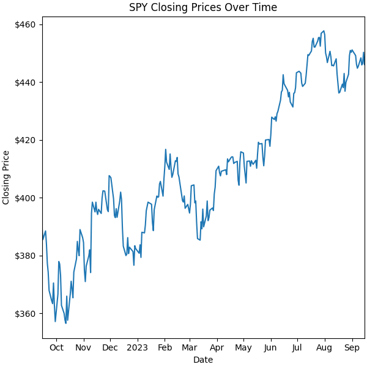

    # This is the generated report for [SPY.csv](https://github.com/nogibjj/LG-Week2-Pandas/blob/main/SPY.csv).
    #It includes both summary statistics and data visualizations

    ## Summary statistics for the Close Variable

    |    | statistic   |    value |
|---:|:------------|---------:|
|  0 | count       | 252      |
|  1 | null_count  |   0      |
|  2 | mean        | 409.341  |
|  3 | std         |  26.0028 |
|  4 | min         | 356.56   |
|  5 | 25%         | 391.56   |
|  6 | 50%         | 407.38   |
|  7 | 75%         | 436.17   |
|  8 | max         | 457.79   |

    ## Data Visualization

    ### Line Graph of SPY closing prices
    

    